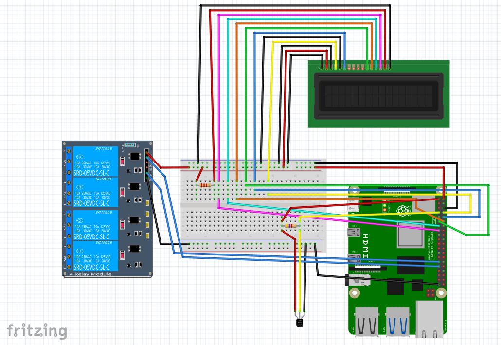
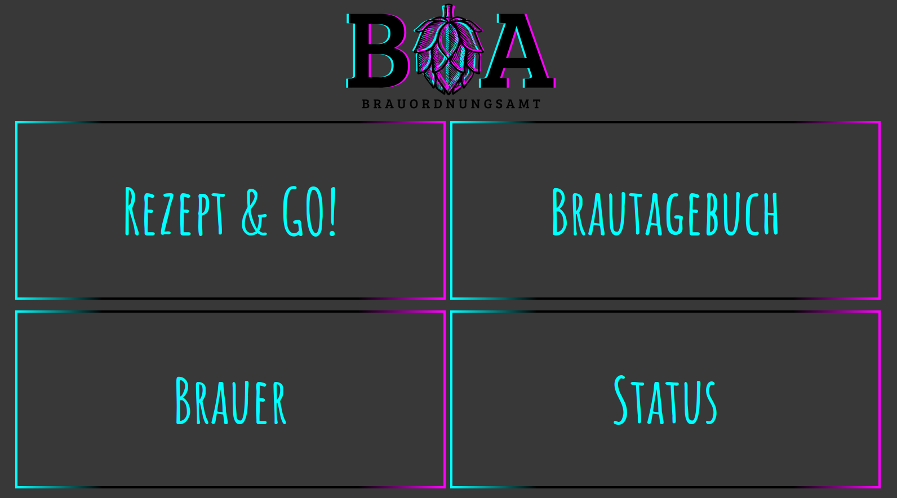

# Willkommen im Brauordnungsamt!
## Was ist das Brauordnungsamt?
</img>  
Das **Brauordnungsamt** ist eine Software zur automatisierten Steuerung des Brauvorgangs von Hobbybrauern.  
Auf Grundlage eines Raspberry Pis sowie einiger Sensoren, Aktoren und elektrotechnischer Bauteile prozessiert das **Brauordnungsamt** ein von dir angelegtes (oder von maischemalzundmehr.de gescraptes!) Rezept vom Einmaischen bis zur fertig gekochten Würze, sodass dir mehr Zeit von deinem Brautag bleibt.  
Außerdem erstellt das **Brauordnugsamt** ein Brautagebuch für dich, dass du jederzeit auf eine potenzielle Kontrolle des Zolls vorbereitet bist.  
Apropos Zoll: Bei Bedarf erstellt dir das **Brauordnungsamt** aus einem deine Brauprotokolle ein vollständiges Formular 2075 zur Biersteueranmeldung in wenigen Klicks!  
Konzipiert wurde das **Brauordnungsamt** für die "Einkocherklasse" - Aber auch die Steuerung von Induktionskochplatten oder Mehrkesselsystemen stellt für die Software kein Problem dar.

## Quick-Installation Guide
Die Installation des **Brauordnungsamt** auf deinem Raspberry Pi ist auch ohne Programmierkenntnisse einfach möglich - an dieser Stelle führe ich dich kurz und kanckig durch den Installationsprozess, sodass du so schnell wie möglich wieder an den Braukessen kannst.

### Voraussetzungen
1. **Raspberry Pi 5** (RAM spielen keine Rolle)
2. **Micro-SD Karte** (Min. 8GB)
3. **Breadboard**
4. **ausreichend Jumperkabel** (M-F, M-M)
5. **DS18B20 Temperatursensor** (wasserdicht, Edelstahlsonde)
6. **Mehrkanal Relais** (5V/10A - mindestens 2-Kanal, bei Mehrkesselsystemen gerne mehr)
7. **1602 LCD-Display**
8. **Schutzkontaktstecker** (zwei, bei Mehrkesselsystemen drei)
9. **Schutzkontaktbuchse** (zwei, bei Mehrkesselsystemen drei)
10. **1m dreiadriges Kabel** (mindestens 1,5mm2 Querschnitt)
11. **WAGO-Klemmen**
  
§ Disclaimer an dieser Stelle: *Strom von der Steckose kann tödlich sein! Elektroinstallationen dürfen nur von Elektrofachkräften durchgeführt werden!*

### Vorbereitungen
Grundsätzlich ist das **Brauordnungsamt** dafür da, Rezepte in einen Prozess zu übersetzen und diese Rezepte temperatur- und zeitgesteuert umzusetzen. Wir müssen also, bevor wir die Software verwenden könne, unseren Raspberry Pi 5 korrekt verkabeln.  
  
Wie immer bei elektronischen Bauteilen verschiedenster Herkunft gilt: im Zweifel haltet euch an die Vorgaben des Herstellers. In diesem Fritzing seht ihr die Verkabelung meiner Bauteile - vor allem beim LCD Display kann es hier zu kleinen Unterschieden kommen.  

| DS18B20 Sensor         |                     | LCD-Display            |                     | Relais-Modul          |                     |
|------------------------|---------------------|------------------------|---------------------|-----------------------|---------------------|
| **Bauteil**            | **Raspberry Pi**    | **Bauteil**            | **Raspberry Pi**    | **Bauteil**           | **Raspberry Pi**    |
| VCC (rot)              | 3.3V                | VSS                    | GND                 | VCC                   | 5V                  |
| DATA (gelb)            | GPIO 4              | VDD                    | 5V                  | GND                   | GND                 |
| GND (schwarz)          | GND                 | VE                     | GND                 | IN 1                  | GPIO 5              |
|                        |                     | RS                     | GPIO 14             | IN 4                  | GPIO 6              |
|                        |                     | RW                     | GND                 |                       |                     |
|                        |                     | Enable                 | GPIO 15             |                       |                     |
|                        |                     | d4                     | GPIO 17             |                       |                     |
|                        |                     | d5                     | GPIO 18             |                       |                     |
|                        |                     | d6                     | GPIO 27             |                       |                     |
|                        |                     | d7                     | GPIO 22             |                       |                     |
|                        |                     | A                      | 5V                  |                       |                     |
|                        |                     | C                      | GND                 |                       |                     |
  
Zusätzlich:  
**DS18B20**: 4,7k Ohm Widerstand zwischen *VSS* und *DATA*  
**LCD-Display**: 2k Ohm Widerstand zwischen *A* am Display und *5V* am Raspberry Pi  

### Installation Brauordnungsamt
1. Lade dir das `brauordnungsamt.img` herunter.
2. Geh' auf <a href="https://www.raspberrypi.com/software/">raspberrypi.com/software</a> und lade dir den Raspberry Pi Imager herunter.
3. Installiere den Raspberry Pi Imager auf deinem Computer und öffne ihn.
4. Wähle als *Device* Raspberry Pi 5 aus und unter *Choose Storage* die Micro-SD Karte für deinen Raspberry Pi.
5. Unter *Choose OS* wählst du *use custom*, ganz unten in der Liste.
6. Wähle im Fenster, das sich nun öffnet, `brauordnungsamt.img`.
7. Ein Pop-Up Fenster fragt nach *OS customisation*, hier muss *edit settings* ausgewählt werden.
8. Unter *GENERAL* muss als hostname **horst** eingetragen werden, als username **tim** - ein Passwort ist frei wählbar.
9. Unter *Configure wireless LAN* muss der Name deines WLANs und das richtige Passwort eingetragen werden. Es muss das gleiche WLAN sein, mit dem auch der Computer verbunden ist, an dem du gerade sitzt!
10. Unter *SERVICES* muss SSH mit Passwort Authentifizierung ausgewählt sein - das Passwort hast du gerade selbst gewählt.
11. Mit *save* bestätigen und im Pop-Up Fenster von vorhin *YES* auswählen und das nächste Fenster mit *YES* bestätigen.
12. Wenn alles fertig ist, kannst du die SD-Karte entfernen, in deinen Raspberry Pi einstecken und ihn starten.

Wenn du jetzt mit einem Browser auf deinem Computer <a href="http://horst.local:8000/">horst.local:8000</a> besucht, siehst du die Landing Page von **Brauordnungsamt**!  
  
  
**Gut Sud!**